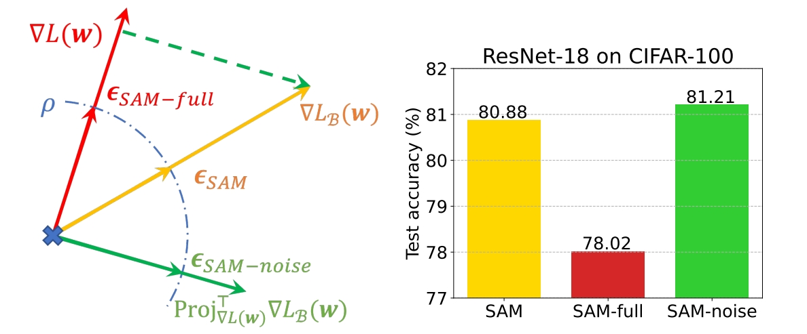

# Friendly Sharpness-Aware Minimization

The code is the official implementation of our CVPR 2024 paper 
[Friendly Sharpness-Aware Minimization](https://arxiv.org/html/2403.12350v1).

In this work, we reveal that the full gradient component in SAM’s adversarial perturbation does not contribute to generalization and, in fact, has undesirable effects. We then propose an efficient variant to mitigate these effects and further enhance the generalization performance of SAM.



## Dependencies

Install required dependencies:

```
pip install -r requirements.txt
```

## How to run

We show sample usages in `run.sh`:

```
bash run.sh
```


## Citation
If you find this work helpful, please cite:
```
@inproceedings{li2024friendly,
  title={Friendly Sharpness-Aware Minimization},
  author={Li, Tao and Zhou, Pan and He, Zhengbao and Cheng, Xinwen and Huang, Xiaolin},
  booktitle={Proceedings of the IEEE/CVF Conference on Computer Vision and Pattern Recognition (CVPR)},
  year={2024}
}
```
